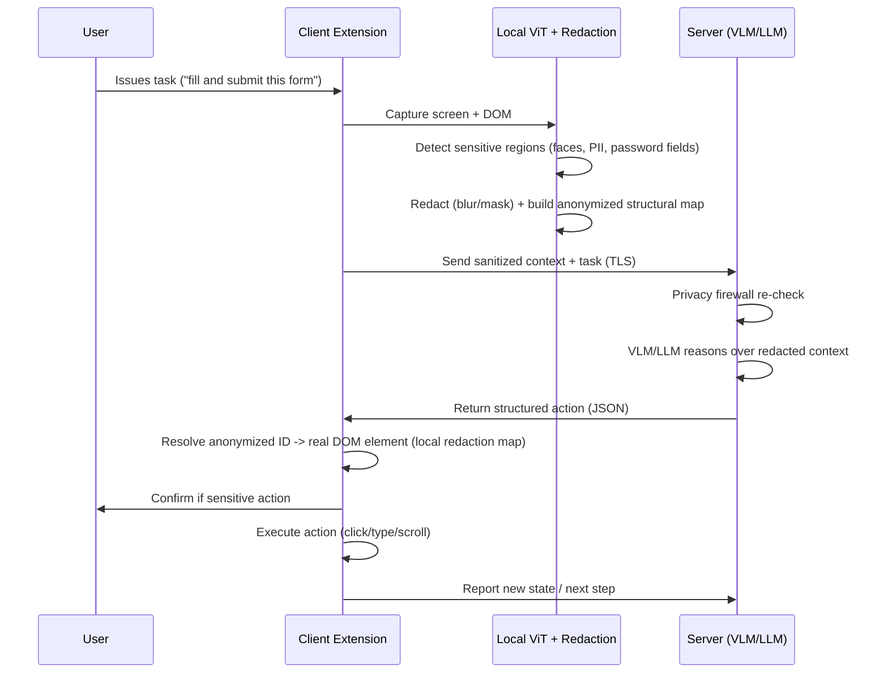

# On-Device Visual Perception for Lightweight Browser Agents
### Detailed System Architecture

---

## 1. Design Goals & Constraints

| Goal | Implication for Architecture |
|---|---|
| Privacy-first | No raw screenshot / PII ever leaves the device unredacted |
| Low resource footprint | Client models must be quantized, WebGPU/WASM-accelerated, <50MB |
| Cross-browser | Built on WebExtensions API (Manifest V3) — works on Chrome & Firefox |
| Low latency | Two-tier inference: fast local heuristics + occasional server round-trip |
| Actionable output | Server returns structured, executable commands, not free text |
| Auditable | Every redaction and action is logged locally for user trust |

---

## 2. High-Level Architecture

```mermaid
flowchart TB
    subgraph Browser["Browser (Client) — Chrome/Firefox Extension"]
        A[Screen/DOM Capturer] --> B[Local ViT Perception Engine\n(ONNX Runtime Web + WebGPU)]
        B --> C[Sensitive Element Detector\nDOM heuristics + Face/Text CV models]
        C --> D[Privacy-Preserving Redaction Engine]
        D --> E[Sanitized Context Builder\n(redacted image + anonymized DOM tree)]
        E --> F[Agent Orchestrator / Session Manager]
        F --> G[Action Executor\n(synthetic DOM events)]
        F <--> H[Secure Transport Layer\nTLS / WebSocket]
    end

    subgraph Server["Server-Side (Cloud or On-Prem)"]
        H <--> I[API Gateway\nAuth, rate limit, session]
        I --> J[Privacy Firewall\n(residual-PII classifier, reject if leak detected)]
        J --> K[VLM/LLM Reasoning Engine\n(Open-weight model)]
        K --> L[Grounding & Action Planner]
        L --> M[Response Serializer\nJSON Action Schema]
        M --> I
    end

    G --> A
```

---

## 3. Client-Side Architecture (Browser Extension)

### 3.1 Screen / DOM Capturer
- Uses `chrome.tabCapture` / `getDisplayMedia` for pixel-level screen state, **and** the Accessibility Tree / DOM (`document.querySelectorAll`, ARIA attributes) for structural state.
- Captures are event-triggered (DOM mutation, click, navigation) rather than polled continuously, to save compute.
- Produces two parallel artifacts per capture:
  1. **Raster frame** (canvas bitmap of viewport)
  2. **Structural map**: a lightweight JSON tree of visible elements `{id, tag, role, bbox, inputType, text-hash}`

### 3.2 Local Vision Perception Engine
- **Model**: a lightweight ViT-family model (e.g., MobileViT-XXS, EfficientFormer, or TinyViT), quantized to INT8, exported to ONNX.
- **Runtime**: ONNX Runtime Web with WebGPU backend (falls back to WASM SIMD if WebGPU unavailable).
- **Function**: classifies UI regions (button, form, text block, image, video) and produces a saliency/segmentation map used to decide *what* needs to be reasoned about and *what* might be sensitive.
- Runs entirely in a Web Worker to avoid blocking the main thread.

### 3.3 Sensitive Element Detector (dual-channel)
| Channel | Technique | Examples Detected |
|---|---|---|
| **DOM-semantic** | Attribute/heuristic scan | `input[type=password]`, `autocomplete=cc-number`, `type=email`, ARIA labels like "SSN", "OTP" |
| **Visual-CV** | Local models (BlazeFace/YuNet for faces; lightweight OCR — Tesseract.js/PaddleOCR-tiny ONNX — + regex/NER) | Faces, credit-card numbers, emails, phone numbers, addresses, ID numbers embedded as *pixels* (e.g. inside a screenshot within the page) |

Both channels emit bounding boxes with a `sensitivity_class` and `confidence`.

### 3.4 Privacy-Preserving Redaction Engine
- Applies redaction **before** any network egress:
  - **Visual**: Gaussian blur / pixelation / solid black-box over bounding boxes on the canvas.
  - **Structural**: replaces sensitive DOM text with placeholder tokens (`[REDACTED_EMAIL_1]`) while preserving element role/position for grounding.
- **Self-verification pass**: a small secondary classifier re-scans the *redacted* frame to confirm no residual PII is visible before allowing transmission (fail-closed: if uncertain, redact more aggressively or block transmission).
- Maintains a local **redaction map** (element ID ↔ real content) that never leaves the device — used later to "de-anonymize" server instructions (e.g., server says "click REDACTED_EMAIL_1 field" → client resolves back to the real element).

### 3.5 Agent Orchestrator / Session Manager
- Decides: *Can this step be resolved locally (e.g., simple scroll, obvious click) or does it need server reasoning?*
- Maintains task state, conversation history, and the redaction map.
- Batches/diffs screen state (sends only deltas since last sync) to cut bandwidth and latency.

### 3.6 Action Executor
- Executes structured commands from the server: `click(selector)`, `type(selector, token)`, `scroll(direction, amount)`, `navigate(url)`.
- Uses synthetic `MouseEvent`/`KeyboardEvent` dispatch or `chrome.debugger` for privileged actions.
- Sensitive actions (submitting a form, payments) require a **user confirmation UI** before execution.

---

## 4. Server-Side Architecture

### 4.1 API Gateway
- Auth (session tokens, no persistent user identity required), rate limiting, request validation.

### 4.2 Privacy Firewall (server-side safety net)
- Independent redaction-validation classifier — assumes client redaction *could* fail and re-checks incoming payload for leaked PII/faces before it ever reaches the reasoning model. Rejects/further redacts non-compliant payloads.

### 4.3 VLM/LLM Reasoning Engine
- Open-weight, offline-deployable model, e.g. **Qwen2-VL**, **MiniCPM-V**, **LLaVA-NeXT**, or **InternVL** for visual+structural reasoning; or a text-only LLM (Llama-3/Mistral) when only the sanitized DOM tree is needed (no image required at all for many steps — further reducing privacy surface).
- Input: redacted screenshot + anonymized structural map + task instruction + short session history.
- Output: semantic intent (e.g., "the user wants to submit the contact form").

### 4.4 Grounding & Action Planner
- Maps the model's semantic target back onto the anonymized element IDs from the structural map (not raw content), producing a precise, executable action.
- Validates the action against the structural map (element exists, is visible, is interactive) before returning it.

### 4.5 Response Serializer
- Emits a strict JSON **Action Schema**, e.g.:
```json
{
  "action": "click",
  "target_id": "el_42",
  "reasoning": "Submit button identified from redacted form layout",
  "requires_confirmation": false
}
```

---

## 5. End-to-End Sequence



---

## 6. Latency vs. Accuracy Trade-off Strategy

| Technique | Benefit |
|---|---|
| INT8 quantized models on client | Smaller memory, faster WebGPU inference |
| Web Worker isolation | Non-blocking UI |
| Delta-based state sync | Sends only changed regions, not full frames |
| Tiered reasoning (local heuristic → local ViT → server VLM only if needed) | Most trivial steps (scroll, obvious click) never touch the network |
| Caching structural maps per site/session | Avoids re-running detection on unchanged DOM |
| Streaming server response | Client can begin resolving grounding as tokens arrive |

---

## 7. Security & Trust Layer
- Manifest V3 strict CSP; extension requests minimal permissions (activeTab, scripting).
- No raw frame or PII is ever persisted — client-side redaction map lives only in memory per session.
- User-facing toggle: "Local-only mode" (no server calls at all, degraded capability) vs "Assisted mode".
- Local audit log of every redaction + action for transparency.
- TLS in transit; ephemeral session tokens; server never stores raw sanitized payloads beyond the session.

---

## 8. Suggested Tech Stack

| Layer | Technology |
|---|---|
| Extension framework | WebExtensions API (Manifest V3), TypeScript |
| Local inference | ONNX Runtime Web (WebGPU/WASM), Transformers.js |
| Local vision models | MobileViT/TinyViT (UI understanding), BlazeFace/YuNet (face detection), Tesseract.js/PaddleOCR-tiny (OCR) |
| Redaction | Canvas API (blur/pixelate), DOM text substitution |
| Transport | HTTPS/WebSocket + TLS |
| Server framework | FastAPI / Node.js |
| Server reasoning model | Qwen2-VL / MiniCPM-V / LLaVA-NeXT (VLM) or Llama-3/Mistral (text-only) |
| Deployment | Docker; offline-capable via local GGUF/ONNX server model for demo independence |

---

## 9. Demo Scenario (End-to-End)
1. User asks the agent: "Fill out this signup form for me using my saved details, but don't leak my email screenshot."
2. Local ViT detects the form, password field, and an email field with visible text.
3. Redaction engine blurs the email text region and masks the password field in the structural map.
4. Sanitized context + instruction sent to server.
5. Server VLM identifies field roles from layout alone (no real values seen) and returns action plan: `click(name_field)`, `type(name_field, token)`, `click(submit_button)`.
6. Client resolves tokens back to real values locally and executes the actions, asking for confirmation before final submit.

This demonstrates the full loop: **on-device perception → redaction → server reasoning → grounded, private execution.**
